# 指令处理完整流程图

## 从收到指令到获得最终响应的全过程

```mermaid
flowchart TD
    Start([收到玩家指令]) --> Validate{参数验证}
    Validate -->|指令为空或类型错误| Error1[返回错误信息]
    Validate -->|验证通过| LoadScene["1. 加载场景<br/>EnvironmentManager.load_scene"]
    
    LoadScene -->|加载失败| Error2[返回错误: 无法加载场景]
    LoadScene -->|加载成功| LoadHistory["1.1 加载对话历史<br/>ConversationHistory.load_recent_history<br/>最近5条记录"]
    
    LoadHistory --> ExtractRole{提取玩家角色}
    ExtractRole -->|未提供| Extract[从场景内容中提取玩家角色]
    Extract --> LoadChars["2. 加载所有角色<br/>CharacterStore.list_characters"]
    ExtractRole -->|已提供| LoadChars
    
    LoadChars -->|未找到角色| Error3[返回错误: 没有找到角色]
    LoadChars -->|找到角色| Pacing["3. 剧情节奏评估<br/>EnvironmentAnalyzer._assess_pacing_before_action"]
    
    Pacing -->|评估是否需要触发事件| CheckPacing{是否需要触发事件?}
    CheckPacing -->|是| GenEvent["生成预期事件<br/>_generate_expected_event<br/>LLM调用: 生成统一停止点"]
    CheckPacing -->|否| CreateAgents["4. 创建智能体<br/>Agent实例化"]
    GenEvent --> CreateAgents
    
    CreateAgents --> Parallel["4.1 并行处理指令<br/>ThreadPoolExecutor<br/>每个Agent.process_instruction"]
    
    Parallel --> Agent1["Agent 1<br/>调用LLM生成响应"]
    Parallel --> Agent2["Agent 2<br/>调用LLM生成响应"]
    Parallel --> AgentN["Agent N<br/>调用LLM生成响应"]
    
    Agent1 --> Collect["收集所有响应<br/>agent_responses列表"]
    Agent2 --> Collect
    AgentN --> Collect
    
    Collect --> Aggregate["5. 聚合响应<br/>ResponseAggregator.aggregate_responses<br/>合并表/里信息"]
    
    Aggregate --> Analyze["6. 分析环境变化<br/>EnvironmentManager.apply_responses_to_environment<br/>LLM调用: 分析场景变化"]
    
    Analyze --> Director["6.1 导演评估阶段<br/>DirectorEvaluator.evaluate_as_director<br/>LLM调用: 基于Agent响应决定事件/场景变化"]
    
    Director --> ProcessDirector{处理导演决策}
    ProcessDirector -->|触发事件| RecordEvent[记录已触发事件]
    ProcessDirector -->|出现怪物| RecordMonster[记录怪物出现]
    ProcessDirector -->|场景转换| TransitionScene[执行场景/房间转换]
    ProcessDirector -->|更新游戏时间| UpdateTime[更新游戏时间]
    
    RecordEvent --> UpdateState
    RecordMonster --> UpdateState
    TransitionScene --> UpdateState
    UpdateTime --> UpdateState
    
    UpdateState{是否提供save_step?}
    UpdateState -->|是| CreateStep["7.1 创建新存档步骤<br/>SaveManager.create_new_step"]
    UpdateState -->|否| Format
    
    CreateStep --> UpdateChar["7.2 更新角色状态<br/>StateUpdater.update_character_state<br/>保存state_changes和attribute_changes"]
    
    UpdateChar --> UpdateScene["7.3 更新场景状态<br/>StateUpdater.update_scene_state<br/>保存场景变化和主要事件"]
    
    UpdateScene --> ReloadScene["7.4 重新加载场景<br/>获取更新后的场景内容"]
    
    ReloadScene --> Format["8. 格式化响应<br/>ResponseFormatter.format_responses_for_player<br/>LLM调用: 转换为玩家视角文本"]
    
    Format --> SaveHistory{是否创建了新步骤?}
    SaveHistory -->|是| SaveConv["8.1 保存对话历史<br/>ConversationHistory.save_conversation"]
    SaveHistory -->|否| ExtractEnv
    SaveConv --> ExtractEnv["9. 提取环境状态信息<br/>从场景内容中提取位置/时间等"]
    
    ExtractEnv --> BuildResult["10. 构建返回结果<br/>组装surface和hidden信息"]
    
    BuildResult --> Return(["返回最终响应<br/>包含:<br/>- surface: 格式化响应/摘要/环境状态<br/>- hidden: 状态变化/原始响应<br/>- new_step: 新步骤<br/>- step_timings: 各步骤耗时"])
    
    style Start fill:#e1f5ff
    style Return fill:#d4edda
    style Error1 fill:#f8d7da
    style Error2 fill:#f8d7da
    style Error3 fill:#f8d7da
    style Pacing fill:#fff3cd
    style GenEvent fill:#fff3cd
    style Agent1 fill:#d1ecf1
    style Agent2 fill:#d1ecf1
    style AgentN fill:#d1ecf1
    style Analyze fill:#fff3cd
    style Format fill:#fff3cd
```



## 详细步骤说明

### 阶段1: 初始化与加载 (步骤1-2)
1. **参数验证**: 检查指令是否为空或类型错误
2. **加载场景**: 从 `save/{theme}/{save_step}/SCENE.md` 或 `characters/{theme}/SCENE.md` 加载场景内容
3. **加载对话历史**: 获取最近5条对话记录，用于上下文
4. **提取玩家角色**: 如果未提供，从场景内容中提取
5. **加载角色**: 从 `CharacterStore` 加载所有或指定的角色配置

### 阶段2: 剧情控制 (步骤3)
6. **剧情节奏评估**: 
   - 调用 `EnvironmentAnalyzer._assess_pacing_before_action`
   - 评估是否需要触发事件（基于场景状态、指令类型、历史事件）
   - 如果需要，生成预期事件描述（统一停止点）

### 阶段3: 并行处理 (步骤4)
7. **创建智能体**: 为每个角色创建 `Agent` 实例
8. **并行调用LLM**: 
   - 使用 `ThreadPoolExecutor` 并行处理
   - 每个 `Agent.process_instruction` 调用LLM生成响应
   - **Agent考虑：自身状态+玩家指令+当前环境**
   - 传递预期事件，确保所有角色在同一事件点停止
9. **收集响应**: 收集所有智能体的响应（包含response、state_changes、attribute_changes）
   - **注意**：这些状态变化是Agent的预期，需要经过环境变化分析后确认

### 阶段4: 响应处理 (步骤5-6)
10. **聚合响应**: 
    - `ResponseAggregator.aggregate_responses`
    - 合并所有响应的表/里信息
11. **分析环境变化**（步骤6）: 
    - `EnvironmentManager.apply_responses_to_environment`
    - 调用LLM分析所有响应，**分析Agent响应对环境的影响，以及Agent响应的实际执行情况**
    - 提取场景变化（位置、时间、事件、**出现的怪物**等）
    - **更新环境状态**（怪物出现后作为环境的一部分，状态保存在环境状态中，不再独立维护角色卡）
13. **导演评估**（步骤6.1，新增）:
    - `DirectorEvaluator.evaluate_as_director`
    - **基于环境变化分析结果**，LLM作为导演评估当前状态并做出决策
    - 决定是否触发事件、是否出现怪物、是否转换场景/房间
    - 处理导演决策：记录事件、更新游戏时间、执行场景转换
    - **怪物出现后作为环境的一部分，状态保存在环境状态中，不再独立维护角色卡**
    - **导演决策带来的变化可能影响Agent的状态**（如触发事件可能改变任务状态、出现怪物可能进入战斗状态、转换场景可能改变位置等）
14. **更新Agent实际状态**（步骤6.5，新增）:
    - `StateUpdater.update_character_state`
    - **依据环境变化分析结果和导演决策带来的变化，更新Agent的实际状态**
    - 确认Agent的实际状态变化（可能与Agent的预期不同）
    - 应用导演决策带来的变化（事件触发、怪物出现、场景转换对Agent状态的影响）
    - 更新Agent的状态和属性

### 阶段5: 状态更新 (步骤7)
12. **创建新步骤**: 如果提供了 `save_step`，创建新的存档步骤
13. **更新角色状态**: 保存每个角色的状态变化和属性变化到新步骤
14. **更新场景状态**: 保存场景变化和主要事件到新步骤
15. **重新加载场景**: 获取更新后的场景内容，用于后续格式化

### 阶段6: 格式化与返回 (步骤8-10)
16. **格式化响应**: 
    - `ResponseFormatter.format_responses_for_player`
    - 调用LLM将原始响应转换为玩家视角的文本
    - 生成第三人称、小说风格的摘要
17. **保存对话历史**: 如果创建了新步骤，保存指令和摘要到历史记录
18. **提取环境状态**: 从更新后的场景内容中提取位置、时间等信息
19. **构建返回结果**: 
    - `surface`: 格式化响应、摘要、环境状态、决策点
    - `hidden`: 状态变化、属性变化、原始响应、执行结果
    - `new_step`: 新创建的步骤
    - `step_timings`: 各步骤的耗时统计

## 关键LLM调用点

1. **剧情节奏评估** (步骤3): 评估是否需要触发事件（用于生成预期事件，统一停止点）
2. **生成预期事件** (步骤3.1): 生成统一停止点事件描述
3. **智能体响应生成** (步骤4): 每个角色调用LLM生成响应（并行），**考虑：自身状态+玩家指令+当前环境**
4. **环境变化分析** (步骤6): 分析Agent响应对环境的影响，以及Agent响应的实际执行情况，更新环境状态
5. **更新Agent实际状态** (步骤6.5，新增): 依据环境变化分析结果，更新Agent的实际状态
6. **导演评估** (步骤6.1，新增): **基于更新后的Agent状态和环境状态**，决定事件触发、怪物出现、场景转换
7. **响应格式化** (步骤8): 将原始响应转换为玩家视角文本

## 关于怪物的处理

- **怪物出现**：导演评估决定让怪物出现后，怪物会被记录在环境状态中
- **作为环境的一部分**：怪物出现后，作为环境的一部分，状态（如HP、MP、位置等）保存在环境状态中（如`SCENE_STATE.json`），不再独立维护角色卡
- **成本优化**：这样可以降低状态管理的复杂度，减少文件数量，但怪物状态仍然会被保存和管理
- **环境描述**：怪物会在场景描述中体现，Agent可以根据环境描述感知到怪物的存在

## 数据流

```
玩家指令
  ↓
场景内容 + 对话历史 + 角色配置
  ↓
剧情节奏评估 → 预期事件（可选）
  ↓
并行LLM调用（每个角色）
  ↓
原始响应列表（JSON格式）
  ↓
响应聚合
  ↓
环境变化分析（分析Agent响应对环境的影响，以及实际执行情况）
  ↓
更新Agent实际状态（依据环境变化分析结果）
  ↓
导演评估（基于更新后的Agent状态和环境状态，决定事件/场景变化）
  ↓
状态更新（角色状态 + 场景状态，怪物作为环境的一部分）
  ↓
响应格式化（LLM调用）
  ↓
最终响应（表/里分离）
```

## 性能优化点

- **并行处理**: 所有智能体同时调用LLM，而非串行
- **状态缓存**: 场景和角色状态在内存中缓存
- **增量更新**: 只更新发生变化的状态，而非全量保存
- **超时控制**: LLM调用有超时和重试机制（30-60秒超时，最多3次重试）

